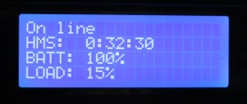

# pfSense LCDproc NUT UPS Monitor



Displays current UPS status, runtime(hours, minutes, seconds) or battery voltage, battery and current load percentage.

Can be used with NUT in pfSense to remote monitor a UPS **but when changing values in pfSense you need to restart the LCDproc service otherwise it won't update.**

Recommended parts: 
* [20x4 or 16x4 character LCD - 20x4 very strongly recommended](https://www.adafruit.com/product/198)
* [Adafruit USB + Serial LCD Backpack Add-On - ADA781](https://www.adafruit.com/product/781)

Using the backpack is the easiest as it only requires soldering to the LCD panel and also provides brightness and contrast control through pfSense.

Tested at the time on pfSense 2.6.0 and pfsense-lcdproc-0.10.8_9
```
Manually install(copy to):
lcdproc_client.php > /usr/local/pkg
lcdproc_screens.php > /usr/local/www/packages/lcdproc
```

This also contains CPU Temperature code for displaying to an LCD. Future repo to follow. Pending pull request.